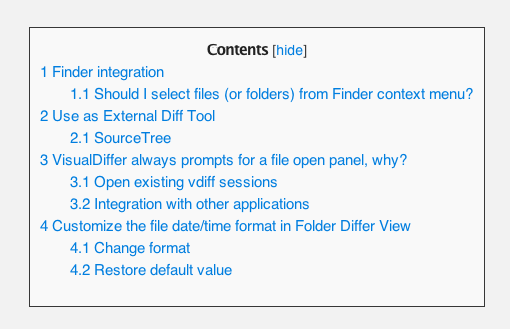

TOC Generator for Markdown
==========================

Table of Contents Generator for Markdown pages.

Using markdown to generate wiki pages is awesome but using [jekyll](https://github.com/mojombo/jekyll) or other static site generators lacks the ability to generate a TOC.  

TOC-MD is a jQuery plugin that generates on the fly a table of contents from an HTML produced by markdown.

## Installation

Include script *after* the jQuery library (unless you are packaging scripts somehow else):

    

## Getting Started

The plugin uses the HTML H1 and H2 elements present in the page to build the TOC.  
H1 and H2 are generated using mardown

The generated content is very similar to the TOC present on mediawiki pages.  

The plugin consists of

* **jquery.toc.js** the javascript code
* **toc.css** the default style sheet, you can change it to be used on your website

## Usage

The plugin by default generates the TOC

* when the page contains more that one H1 or contains only one H1 with sublevels (eg H2)
* saving the hide/show status into cookie (if the cookie plugin is present)

Generate the toc starting from DOM element with id main_content:

	$('#main_content').toc();
	
Generate the toc always, also if page contains only one H1

	$('#main_content').toc({
		showAlways:true
	});

## Plugin configuration

The following parameters can be passed to toc() function

* **anchorPrefix** (default: 'tocAnchor-') the default prefix used for generated TOC elements IDs
* **showAlways** (default: false) Show TOC also if only one H1 is present on page, the TOC is never show if no H1s are found on page
* **saveShowStatus** (default: true) Save the collapse status using a cookie (see dependecies for further details)
* **contentsText** (default: 'Contents') The label text shown for Content, you can localize passing another string 
* **hideText** (default: 'hide') The label text shown for hide button, you can localize passing another string 
* **showText** (default: 'show')  The label text shown for show button, you can localize passing another string 
	
Example

	$('#main_content').toc({
		showAlways:true,
		showText:'Expand TOC',
		saveShowStatus:false
	});

## Dependencies

* The [cookie plugin](https://github.com/carhartl/jquery-cookie) if present allow to save collapse status when user click on hide/show button. If the cookie plugin is not present the saveShowStatus paramenter is ignored